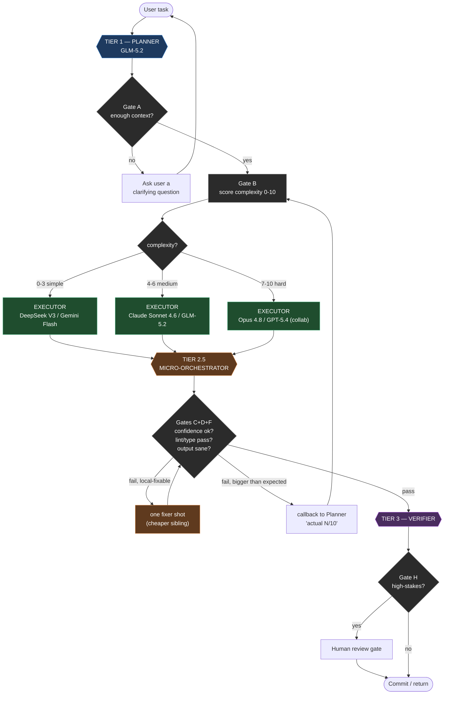
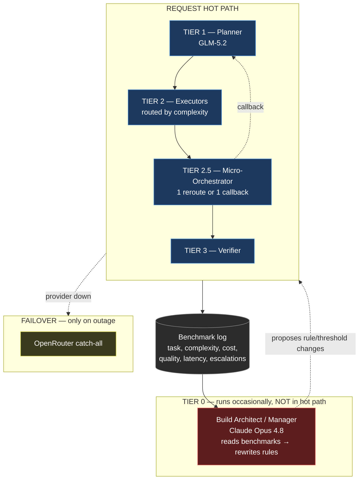
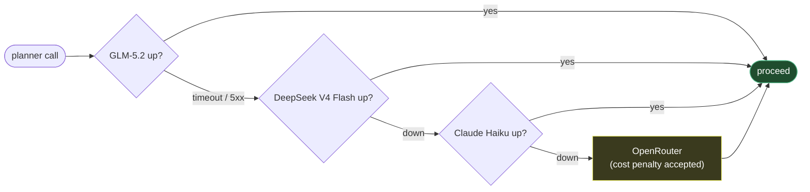
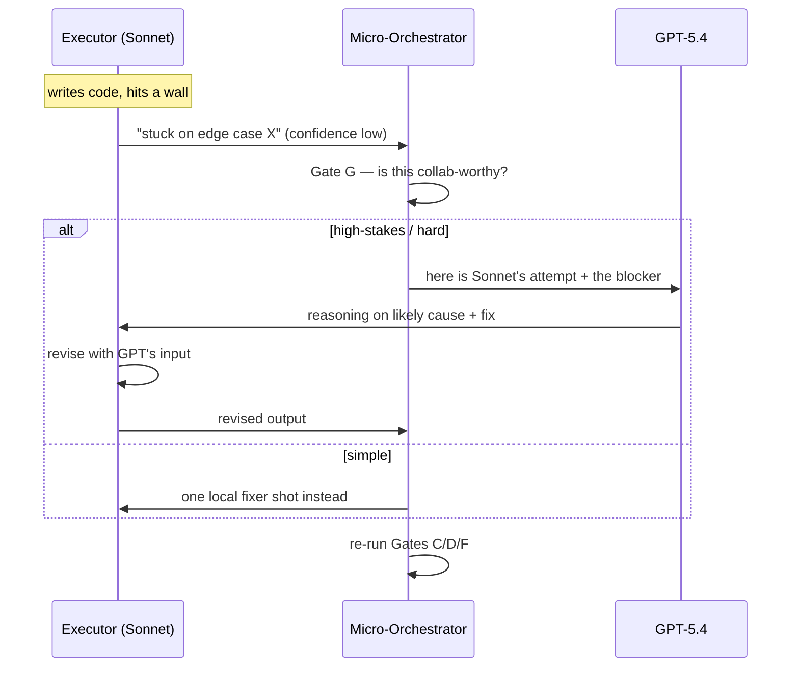

# Orchestration Flowcharts

Mermaid renders natively on GitHub. To export an image: paste into
[mermaid.live](https://mermaid.live) → download SVG/PNG.

---

## 1. Full request lifecycle

---

## 2. Tier hierarchy + who talks to whom

---

## 3. Fallback chain (provider bouncing)

What happens when a provider crashes mid-task — chains hop between
**independent providers** so one outage never stalls the pipeline.

---

## 4. Collaborative debug (Gate G) — only when an executor is stuck

